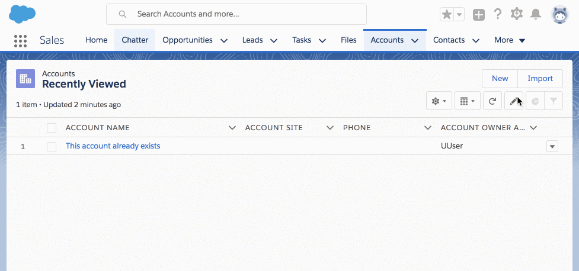

# apex-mocks-sfdx

This is a little project built on top of [Apex Mocks](https://github.com/financialforcedev/fflib-apex-mocks/).
It shows:
* A way of deploying Apex Mocks as part of an SFDX project.
* A few examples of using Apex Mocks in unit tests.

## Simple Deploy
1. If you don't have a Dev Hub, sign up for a trial here:
	* Complete the form on the [sign up page](https://developer.salesforce.com/promotions/orgs/dx-signup)
	* Note. The org will expire in 30 days
1. Click the button below and log into your dev hub when prompted:<br>
	[](https://deploy-to-sfdx.com) 

## Manual deployment
This app is built and deployed via SFDX.

1. If you don't have a Dev Hub, sign up for a trial here:
	* Complete the form on the [sign up page](https://developer.salesforce.com/promotions/orgs/dx-signup)
	* Note. The org will expire in 30 days
1. If you don't have the SFDX CLI:
	* Download it [here](https://developer.salesforce.com/tools/sfdxcli)
	* Or install via brew
		```shell
		brew cask install caskroom/cask/sfdx
		```
1. Authenticate with your dev hub
	```shell
	sfdx force:auth:web:login -d
	```
	* Log into your dev hub when prompted, then close the browser.
1. Create a scratch org:
	```shell
	sfdx force:org:create -f config/project-scratch-def.json -s
	```
1. Push source to scratch org:
	```shell
	sfdx force:source:push
	```
1. Launch the scratch org in a browser:
	```shell
	sfdx force:org:open
	```
## The Sample Application


We are going to deploy a simple AccountsTrigger that attempts to stop you from creating duplicate Accounts.
Yes, yes, I know Salesforce already has built-in Duplicate Management.
We're going to make our own version just to demonstrate some ApexMocks concepts.

So what happens when you insert/update Accounts in this sample app?
If we're running `after insert` or `after update` - then we'll query the database to check if there are other Accounts with the same names. If there are, we stop the record from being saved.
You can trace the codepath through [AccountsTrigger.trigger](force/main/default/triggers/AccountsTrigger.trigger) - it's heavily commented and should explain what's going on at each point.

## The Important Bits

### Deploying ApexMocks
If we were working with Java, we could pull ApexMocks in from Maven.<br>
If we were working with Node.js, we could pull ApexMocks in from NPM.<br>
If we were working with... well, you get the picture.

We don't have a sophisticated package manager for pulling in versioned, unmanaged code.
So we're going to manually copy the files from fflib-apex-mocks, as and when we need them.
At the time of writing, these are the files as of the [HEAD of master in financialforcedev/fflib-apex-mocks](https://github.com/financialforcedev/fflib-apex-mocks/commit/af89f78a355c4513428f263e96592b03ccf3ee1e).

If at any point in the future, we want a later version of ApexMocks, it will be an icky manual process.
You could consider experimenting with submodules, but we do not endorse this approach!

We've put the fflib-apex-mocks source code here: [fflib-apex-mocks/main/default].
We've put the sample application code here: [force/main/default].
This keeps some level of separation between them, making it easy to see how things fit together.
It also makes it easier to upgrade ApexMocks later if we need to.

Look at our sfdx-project.json. Notice that force is the default package directory - that means when we pull code from our scratch org it goes into the correct directory.
```json
"packageDirectories": [
	{
		"path": "force",
		"default": true
	},
	{
		"path": "fflib-apex-mocks",
		"default": false
	}
],
```

All ApexMocks classes are prefixed with fflib_. This prevents filename collissions when it gets integrated into our sample app code.
For example, if both ApexMocks and our app tried to define a file called Answer, there can only be one Answer class in the scratch org so one of the versions would be lost.

Let's take advantage of this... Look at our .gitignore. What this means is: you can make a change to the ApexMocks classes in your scratch org, but you can't check them in. Changes to ApexMocks should be made in the ApexMocks repo for everyone to enjoy - then copied here in the standard way.
```
force/**/fflib_*
```

### Creating Fake Objects For Mocking
Unsurprisingly, ApexMocks is all about mocks.
Let's get our vocabulary clear so we're all talking the same language!

Great code is divided into small, single-purpose, reusable, modular classes. Each class does *one thing, only one thing, and it does that thing well*. If I was a class, I would be able to do some processing, or I could instead orchestrate other classes to do processing for me. Those classes can be referred to as my *dependencies*.

When we unit test each class, we want to *isolate its dependencies*. We do this by replacing the real dependencies with mocks. A mock is a "Test Double" - a lean object which emulates the one it is standing in for. It has no logic of its own, just the behaviour we define within the context of our unit test.

So how do we create a mock? In both cases, we need an instance of fflib_ApexMocks(), which acts as our Stub Provider.

#### 1. Creating Mocks with fflib_ApexMocks.mock(..) (Internally Uses the Stub API)
This is the recommended approach. As an example, let's create a mock of [AccountsSelector](force/main/default/classes/AccountsSelector.cls).

```java
fflib_ApexMocks mocks = new fflib_ApexMocks();
AccountsSelector mockSelector = (AccountsSelector)mocks.mock(AccountsSelector.class);
```

We have created a mock: `mockSelector`. We can use stub behavior on to the mock, and we can verify how the mock was used (if at all) during the test.

What is the mockSelector? If you inspect its type in debug logs, you'll find it's actually a `AccountsSelector__sfdc_ApexStub` class. You won't find this class in source control anywhere! This class was dynamically created at runtime, and it extends AccountsSelector.

So it inherits all of the AccountsSelector methods, and as far as the code is concerned, *the mockSelector is just a plain old AccountsSelector*. But this ain't no ordinary selector - any time you invoke a method on this mock, it will be handed straight over to the mock framework to register the invocation and invoke your predefined behavior.

Before you get carried away, the Stub API has limitations:
* It only works in tests.
	* So you can't use this trick to instantiate dynamic subclasses in production code.
* It only works in your namespace.
	* So you can't mock out classes from other namespaces.
	* On the other hand, mocking best practices say *you should only mock code that you own* anyway!
* There are limitations around mockable types.
	* The full list is [here](https://developer.salesforce.com/docs/atlas.en-us.apexcode.meta/apexcode/apex_testing_stub_api.htm).
	* It includes private classes, inner classes, abstract classes, classes that implement the `Batchable` interface.

#### 2. Creating Mocks with The ApexMocks Generator
Before the Stub API, the ApexMocks generator is a Java application that parses your Apex classes to generate mock classes.
Where possible, you should create mocks using `fflib_ApexMocks.mock(..)`. If for some reason you can't (e.g. you need to mock a Batchable class), then you can still use the ApexMocks generator.

We'll use `AccountsSelector` as an example again. `AccountsSelector` cannot be extended (it doesn't have the virtual keyword), so we're going to define a new interface IAccountsSelector, and let the generator create a test double that implements the interface.

1. Define IAccountsSelector
	```java
	public interface IAccountsSelector
	{
		Account[] getForNames(Set<String> names);
	}
	```
1. Change AccountsSelector to implement IAccountsSelector.<br>
	Change the AccountsSelector.newInstance method return type to IAccountsSelector.
	```java
	public class AccountsSelector implements IAccountsSelector
	{
		@TestVisible
		private static IAccountsSelector instance = null;

		public static IAccountsSelector newInstance()
		{
			if (instance == null)
			{
				instance = new AccountsSelector();
			}

			return instance;
		}
		//...
	```
1. Create an interfacemocks.properties file that tells the generator the name of the generated class (and optionally if you want to modify the keywords or extend other classes).
	```
	IAccountsSelector=AccountsSelector
	```
1. Generate the mock IAccountsSelector, by running this command:
	```shell
	java -jar apex-mocks-generator-4.0.1.jar "force/main/default/classes" "interfacemocks.properties" "Mocks" "force/main/default/classes" "41.0"
	```
	* Now you should have a new class, force/main/default/classes/Mocks.cls, containing an AccountsSelector inner class that you can use as a test double.
	```java
	/* Generated by apex-mocks-generator version 4.0.1 */
	@isTest
	public class Mocks
	{
		public class AccountsSelector implements IAccountsSelector
		{
			private fflib_ApexMocks mocks;

			public AccountsSelector(fflib_ApexMocks mocks)
			{
				this.mocks = mocks;
			}

			public Account[] getForNames(Set<String> names)
			{
				return (Account[]) mocks.mockNonVoidMethod(this, 'getForNames', new List<Type> {System.Type.forName('Set<String>')}, new List<Object> {names});
			}
		}

	}

	```
1. And finally, you can instantiate this in your test like this:
	```java
	fflib_ApexMocks mocks = new fflib_ApexMocks();
	IAccountsSelector mockSelector = new Mocks.AccountsSelector(mocks);
	```

You can now commit the Mocks file into source control, but if any of the interfaces inside are changed, you would need to regenerate it. Alternatively, you could gitignore the Mocks file, and create a build process that regenerates it before deployment.

### Dependency Injection
Remember this from earlier?
> Unsurprisingly, ApexMocks is all about mocks.<br>
> ...<br>
> When we unit test each class, we want to *isolate its dependencies*. We do this by replacing the real dependencies with mocks.<br>
> A mock is a "Test Double" - a lean object which emulates the one it is standing in for.

Mocks *stand in* for the real dependencies. We need each class to use the standard dependencies when the app is running, but the mock dependencies in the corresponding unit tests.

So we need to **inject** different **dependencies**, depending on the **context** in which the code is running. This is called Context Dependency Injection - rather sensible if you ask me!

There are different ways of doing dependency injection.

#### 1. Constructor dependency injection
We haven't used this pattern in this sample app, but the basic premise is this:
1. Each class has private final variables representing an instance of each dependency.
	* The variables are final, so they need to be set in the constructor.
	* Once set, the variables cannot be changed.
1. Each class defines a public no-argument constructor.
	* This is used by production code.
	* Each of the dependencies is instantiated and stored in the corresponding private final variable.
1. Each class also defines a private testvisible constructor.
	* This is used by test code.
	* Each of the dependencies is supplied as an argument in the constructor, and stored in the corresponding private final variable.
	* The tests supply mocks instead of the standard dependencies.

```java
public class DuplicateAccountBlocker
{
	@testVisible private final AccountsSelector selector;
	
	public DuplicateAccountBlocker()
	{
		this.selector = new AccountsSelector();
	}
	
	public DuplicateAccountBlocker(AccountSelector mockSelector)
	{
		this.selector = mockSelector;
	}

	//...
```

#### 2. Dependency factory injection
There is a sophisticated injection factory in [fflib-apex-common](https://github.com/financialforcedev/fflib-apex-common/blob/master/fflib/src/classes/fflib_Application.cls). You can see examples of its usage in the accompanying [sample app](https://github.com/financialforcedev/fflib-apex-common-samplecode).

This application uses a simplified version of this pattern, to keep the code lean and easy to follow.

* Each class has a static member called `instance`.
	* Only this class and test classes can get or set this value.
* Each class has a static helper `newInstance`.
	* The first time you call `newInstance()`, it will check if the `instance` has been set, and if so, use it.
	* If not, it will create a new instance of the class.
	* Tests can set the instance to a mock before `newInstance()` is invoked, so that the mock is returned to the caller instead of the real dependency.

```java
@TestVisible
private static IAccountsSelector instance = null;

public static IAccountsSelector newInstance()
{
	if (instance == null)
	{
		instance = new AccountsSelector();
	}

	return instance;
}
```

#### 3. @Inject Annotation
In Java, you can define injected dependencies by annotating them with @Inject, and running a dependency injection framework like Spring.
But, this is Apex so you can just forget all about this technique!

### Matchers
ApexMocks allows you:
	* to stub behavior (when I call `X` with arguments `Y` then return `Z`)
	* to verify behavior (make sure I called `X` with arguments `Y` exactly `Z` times)

But what exactly does *with arguments `Y`* mean? Well, by default, ApexMocks just does an == comparison between the expected and actual arguments.
You may need to be more or less specific than that.

This is where matchers come in! These are very much modelled on the concept of [matchers in Mockito](https://static.javadoc.io/org.mockito/mockito-core/2.12.0/org/mockito/Mockito.html#argument_matchers).

#### 1. Verifying With Matchers
Look at this example in [DuplicateAccountBlockerTest](force/main/default/classes/DuplicateAccountBlockerTest.cls).
As part of our test, we want to check that the `mockSelector.getForNames(..)` method was never called.
We could do this without matchers:
```java
((AccountsSelector)mocks.verify(mockSelector, mocks.never())).getForNames((Set<String>)expectedNames);
```

But what if our test did invoke getForNames, but it used a different set of expectedNames?
To make our test completely rigorous, let's check that the method was never invoked at all, and not worry about the specific arguments it was invoked with.

We use the `fflib_Match.anyObject()` matcher.
```java
((AccountsSelector)mocks.verify(mockSelector, mocks.never())).getForNames((Set<String>)fflib_Match.anyObject());
```

#### 2. Stubbing With Matchers
Look at this example in [AccountsTest](force/main/default/classes/AccountsTest.cls).
In our test setup, we need to specify the return value when `mockAccountBlocker.preventDuplicates(..)` is invoked.
We will cover `thenAnswer(..)` in the next section, so ignore that bit for now.

`expectedRecords` is a Map of SObjects, keyed by their Id.

But we haven't inserted these expectedRecords in the database yet, so they don't have Ids.
By the time preventDuplicates is invoked, the records will be inserted into the database and gain automatic fields like Created By, Last Modified By etc.

So our mock will not execute our stubbed behavior, because the records we specified won't match the records supplied at runtime.
```java
mocks.startStubbing();
mocks
	.when(mockAccountBlocker.preventDuplicates(expectedRecords)))
	.thenAnswer(new AnswerAddError());
mocks.stopStubbing();
```

So let's be more relaxed about whether or not the arguments match!
We'll define a custom matcher: MapWithSameAccounts, and in it we'll just check the Account names match. Go to [AccountsTest](force/main/default/classes/AccountsTest.cls) to see the whole thing in action.
```java
private static Map<Id, Account> mapWithSameAccounts(Account[] toMatch)
{
	return (Map<Id, Account>)fflib_Match.matches(new MapWithSameAccounts(toMatch));
}

private class MapWithSameAccounts implements fflib_IMatcher
{
	private Account[] toMatch;

	public MapWithSameAccounts(Account[] toMatch)
	{
		this.toMatch = toMatch;
	}

	public Boolean matches(Object arg)
	{
		// custom matching logic here...
	}
}
```

And now we can use the matcher in the `.when(..)`!
```java
mocks.startStubbing();
mocks
	.when(mockAccountBlocker.preventDuplicates(mapWithSameAccounts(expectedRecords)))
	.thenAnswer(new AnswerAddError());
mocks.stopStubbing();
```

#### 3. AssertEquals With Matchers
As a bonus, you can use matchers in your assertions!

We've already seen that matchers allow us to define what exactly we mean when we check if two things are "equal."
For example, we use `SObject.addError('This is my testing error')` so that attempting to save our Account results in a DML exception.
But the generated error message has a lot of unwanted clutter: `"Insert failed. First exception on row 0; first error: FIELD_CUSTOM_VALIDATION_EXCEPTION, This is my testing error: []"`.

As the majority of the error message is generated by Salesforce, it could possibly change in future releases. Also, we just want to know that our error message is part of the overall error, so testing against the whole message clouds the intent of the test.

So instead of doing 
```java
System.assertEquals('Insert failed. First exception on row 0; first error: FIELD_CUSTOM_VALIDATION_EXCEPTION, This is my testing error: []', e.getMessage());
```

We can do:
```java
fflib_System.assertEquals(fflib_Match.stringContains('This is my testing error'), e.getMessage());
```

Ahhh. Much cleaner!

### Answers
Answers allow you to define custom behavior when a method is stubbed.
ApexMocks allows you to return a value or throw an exception. Sometimes you need the stubbed method to do more than that:
e.g.
* Modify the supplied arguments in some way, e.g.
	* Set SObject record Ids, to emulate saving to the database
	* Add errors to SObject records, to prevent them from being saved
* Use the supplied arguments in generating the answer, e.g.:
	* emulating translation)

Let's take another look at that answer in [AccountsTest](force/main/default/classes/AccountsTest.cls) from earlier...
```java
mocks.startStubbing();
mocks
	.when(mockAccountBlocker.preventDuplicates(mapWithSameAccounts(expectedRecords)))
	.thenAnswer(new AnswerAddError());
mocks.stopStubbing();
```

AnswerAddError can inspect the arguments supplied to `mockAccountBlocker.preventDuplicates(..)`, and process them further.
```java
public class AnswerAddError implements fflib_Answer
{
	public Object answer(fflib_InvocationOnMock invocation)
	{
		Map<Id, Account> records = (Map<Id, Account>)invocation.getArgument(0);
		Utilities.newInstance().addError(records.values(), 'This is my testing error');
		
		return records.keySet();
	}
}
```
